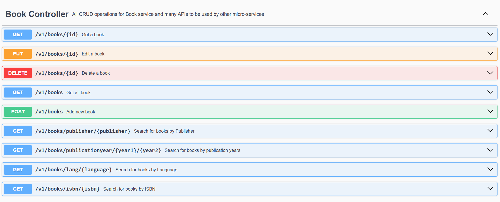

# BookStore Book Service


## Table of Contents

- [Project Overview](#project-overview)
- [Getting Started](#getting-started)
    - [Prerequisites](#prerequisites)
    - [Running the Server](#running-the-server)
- [Book Service APIs](#Book-Service-APIs)

## Project Overview

Book microservice is responsible for managing books. This service provides APIs for CRUD operations on books,
including adding new books, retrieving book details, updating book information, and deleting books.
It uses a relational database MySQL to store book data.

## Getting Started

### Prerequisites

To run this project, you need the following tools installed:

- [Java Development Kit (JDK)](https://www.oracle.com/java/technologies/javase-downloads.html)
- [Maven](https://maven.apache.org/download.cgi)

### Running the Book Service

1. Clone this repository to your local machine:

   ```bash
   https://github.com/samah222/BookStore-microservices.git
2. Navigate to config server and run it first
   ```bash
    cd config-server
    mvn spring-boot:run

3. Second, navigate to Eureka-server and run it:
   ```bash
    cd Eureka-server
    mvn spring-boot:run

4. Third, navigate to API-gateway and run it:
   ```bash
   cd API-gateway
   mvn spring-boot:run

5. Finally, navigate to the book project directory and run it:
    ```bash
   cd book-service
   mvn spring-boot:run

The Book service will start on port 8081, see the application.yaml file.
To build docker image for this service. There are two options, using Dockerfile or using Buildpacks:

Then to build the image use the following commands:
    
    mvn spring-boot:build-image

### Book Service APIs



