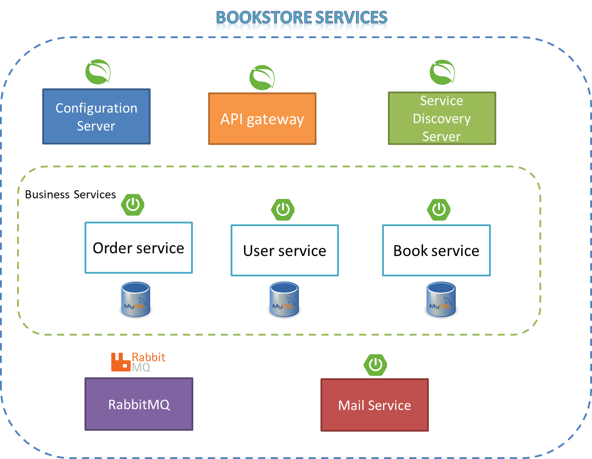

# BookStore microservices
BookStore microservice is a project ro manage Book store which has user management, Books and order services. It consists of the following:

## Table of Contents

- [Config Server](#Config_Server)
- [Eureka Server](#Eureka_Server)
- [API_Gateway](#API_Gateway)
- [Book Service](#Book_Service)
- [Order Service](#Order_Service)
- [User Service](#User_Service)
- [Mail Server](#Mail_Server)
- [Technologies Used](#Technologies_Used)

### Config Server
It provides a centralized location for storing and distributing
configuration properties for all bookstore services (eureka server, API gateway, 
book, order and user) with different profiles(dev, test and prod). 

### Eureka Server
It acts as service discovery for microservices, which is a way for applications and microservices to locate
each other on a network automatically.

### API Gateway
It acts as a centralized entry point for all bookstore microservice.
It manages the incoming requests and routes them based on key
factors such as request path, headers, and query parameters, among others.

### Book Service
Book microservice is responsible for managing books. This service provides APIs for CRUD operations on books,
including adding new books, retrieving book details, updating book information, and deleting books.
It uses a relational database MySQL to store book data.

### Order Service
Order microservice is responsible for managing orders. This service handles creating new orders,
retrieving order details, updating order status, and canceling orders. It uses database transactions
to ensure data consistency when processing orders.

### User Service
User Service is responsible for managing user accounts and authentication. Implement APIs for user registration,
change password, password reset, and profile management. It uses RabbitMQ to publish the mail data. So, any
consumer (email server or SMS gateway) can consume the messages and send them.  

### Mail Server
It is JavaMail server, that use RabbitMQ to consume the sent emails from all other service. RabbitMQ acts 
as a mediator between producers of messages and consumers who receive and process those messages.

## Technologies Used
Bookstore microservice project uses many frameworks of Spring Boot as:
 - Spring web: to build REST APIs
 - Spring Cloud (Config, Eureka server,OpenFeign): spring cloud provides many sub-projects
to manage the microservice, such as providing central config server, service discovery and load-blancer, and
REST client to enable the services communicate with each others
 - Spring JPA: to manage DB operations
 - Actuator: to monitor the service and get metrics
 - JavaMailSender: to send emails e.g. user registration token, password change tokens
 - Spring Validation: to validate objects including Hibernate validator.
 - Spring AOP: to encapsulate and modularize cross-cutting concerns (e.g. logging)

In addition of Spring boot, the project uses the following:
- MYSQL database: used as the relational DB for all services 
- RabbitMQ: to publish the mail for the consumers
- Docker and Docker-compose: the project provides one docker-compose file so, the whole application can easily build and run
- springdoc-openapi: automate the generation of API documentation.
