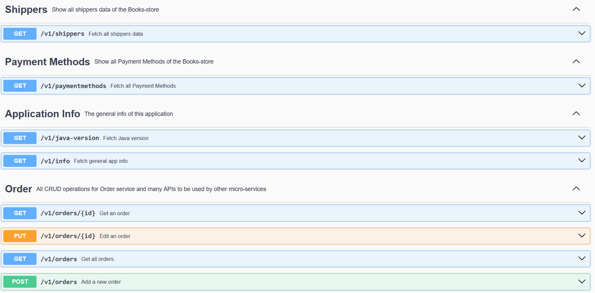

# BookStore Order Service


## Table of Contents

- [Project Overview](#project-overview)
- [Getting Started](#getting-started)
    - [Prerequisites](#prerequisites)
    - [Running the Server](#running-the-server)
- [Order APIs](#Order-APIs)

## Project Overview

Order microservice is responsible for managing orders. This service handles creating new orders,
retrieving order details, updating order status, and canceling orders. It uses database transactions
to ensure data consistency when processing orders.

## Getting Started

### Prerequisites

To run this project, you need the following tools installed:

- [Java Development Kit (JDK)](https://www.oracle.com/java/technologies/javase-downloads.html)
- [Maven](https://maven.apache.org/download.cgi)

### Running the Order Service

1. Clone this repository to your local machine:

   ```bash
   https://github.com/samah222/BookStore-microservices.git
2. Navigate to config server and run it first
   ```bash
    cd config-server
    mvn spring-boot:run

3. Second, navigate to Eureka-server and run it:
   ```bash
    cd Eureka-server
    mvn spring-boot:run
   
4. Third, navigate to API-gateway and run it:
   ```bash
   cd API-gateway
   mvn spring-boot:run

5. Finally, navigate to the order project directory and run it:
    ```bash
   cd order-service
   mvn spring-boot:run

The Order service will start on port 8082, see the application.properties file.
To build docker image for this service. There are two options, using Dockerfile or using Buildpacks:

Then to build the image use the following commands:

    mvn spring-boot:build-image

## Order Service APIs

