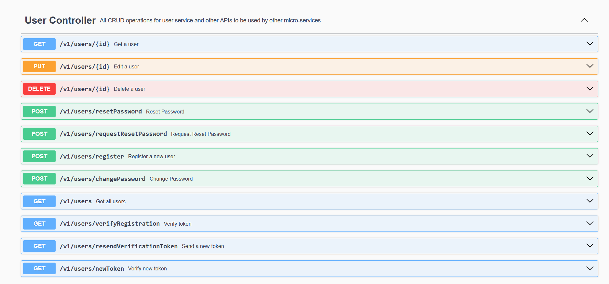

# BookStore User server


## Table of Contents

- [Project Overview](#project-overview)
- [Getting Started](#getting-started)
    - [Prerequisites](#prerequisites)
    - [Running the Server](#running-the-server)
- [User Service APIs](#User-Service-APIs)

## Project Overview

User Service is responsible for managing user accounts and authentication. Implement APIs for user registration,
change password, password reset, and profile management. User Service publish all mails for RabbitMQ to register
new user, password reset and password changes. So, the mail-service can consume the data and send it.

## Getting Started

### Prerequisites

To run this project, you need the following tools installed:

- [Java Development Kit (JDK)](https://www.oracle.com/java/technologies/javase-downloads.html)
- [Maven](https://maven.apache.org/download.cgi)

### Running the User Service

1. Clone this repository to your local machine:

   ```bash
   https://github.com/samah222/BookStore-microservices.git
2. Navigate to config server and run it first
   ```bash
    cd config-server
    mvn spring-boot:run

3. Second, navigate to Eureka-server and run it:
   ```bash
    cd Eureka-server
    mvn spring-boot:run

4. Third, navigate to API-gateway and run it:
   ```bash
   cd API-gateway
   mvn spring-boot:run

5. Finally, navigate to the user project directory and run it:
    ```bash
   cd user-service
   mvn spring-boot:run

The user service will start on port 8083, see the application.properties file.
To build docker image for this service. There are two options, using Dockerfile or using Buildpacks:

Then to build the image use the following commands:

    mvn spring-boot:build-image

### User Service APIs



